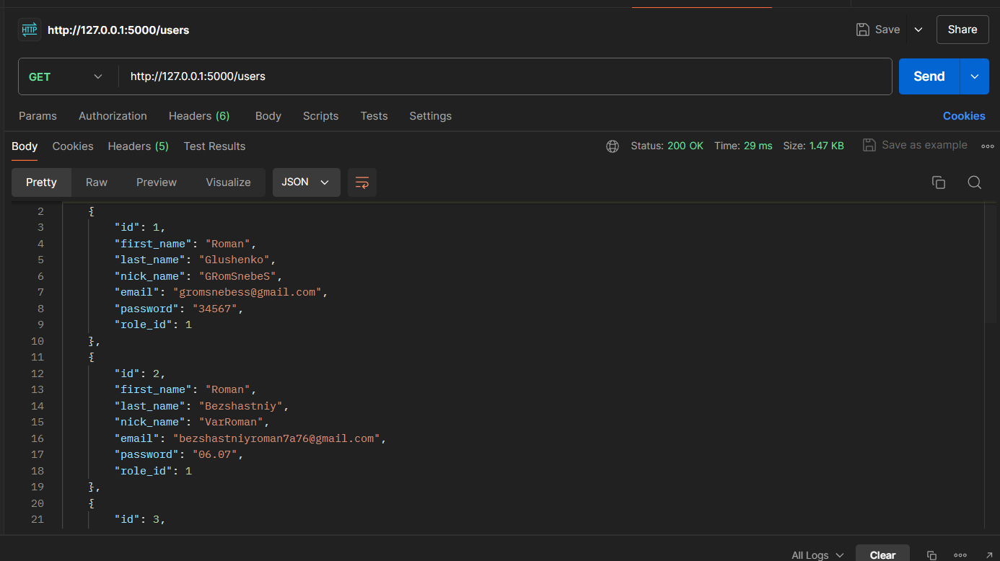
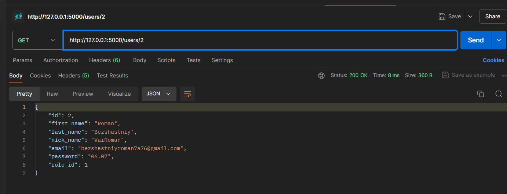
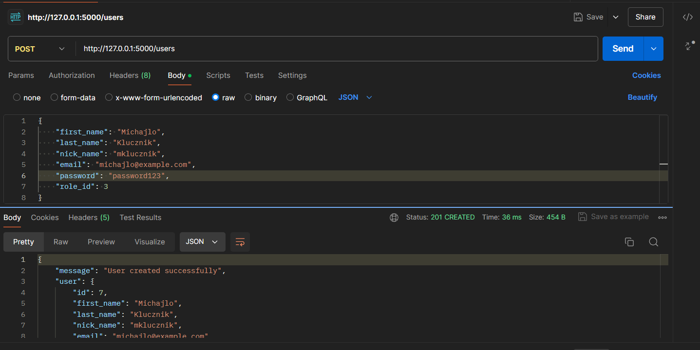
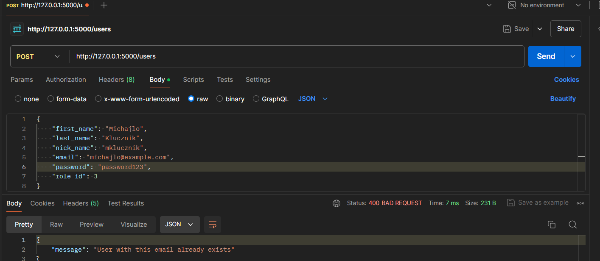
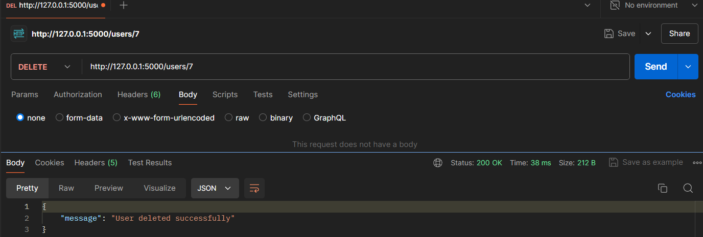
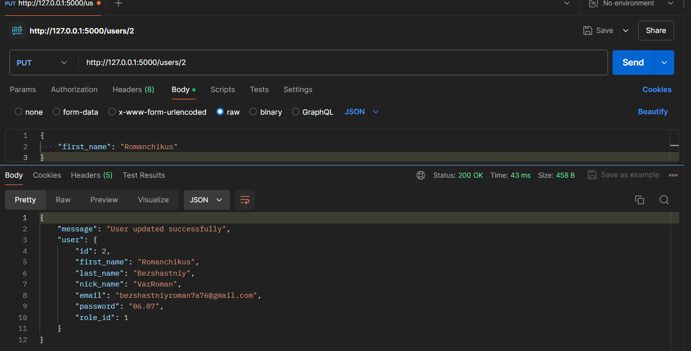
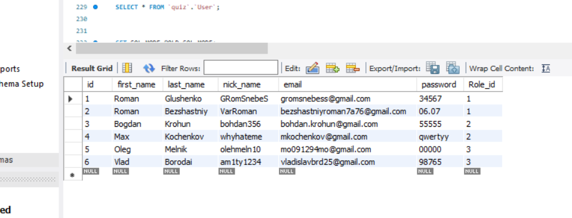

# Тестування працездатності системи

## Засоби тестування
Тестування CRUD застосунку здійснюється за допомогою онлайн інструменту Postman. Перед тестуванням запитів на локальному сервері необхідно встановити Postman Agent.

### Отримання інформації по всім User-ам

### Отримання інформації по id User-а

### Створення нового юзера

### Помилка створення юзера по причині: "Така електронна пошта вже існує"

### Видалення юзера

### Оновлення юзеру

### Вміст таблиці 'User' у базі 'quiz'  даних після виконання усіх операцій

